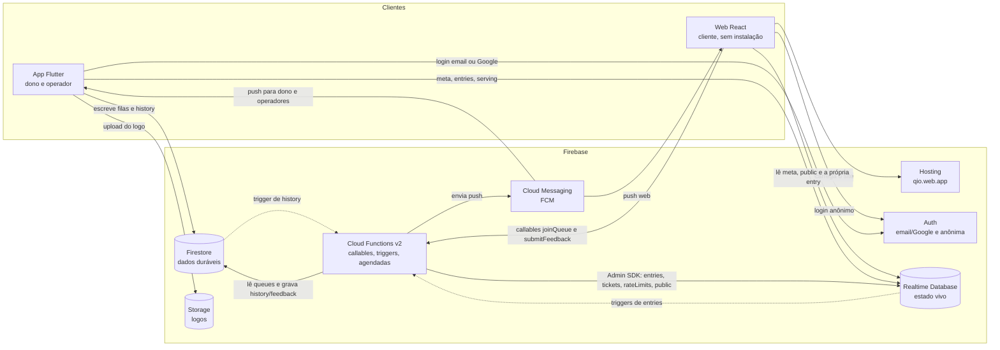
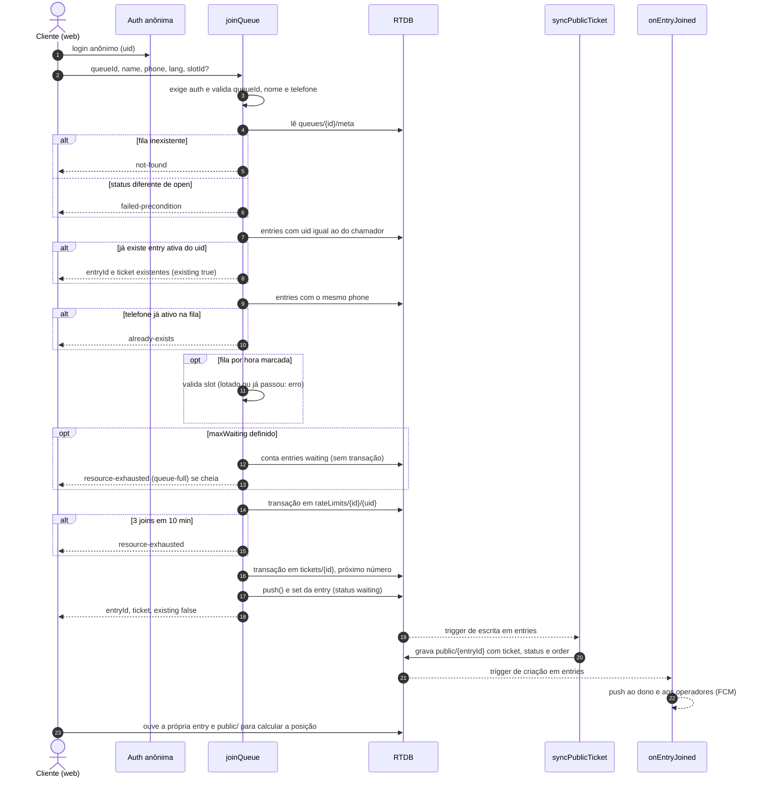
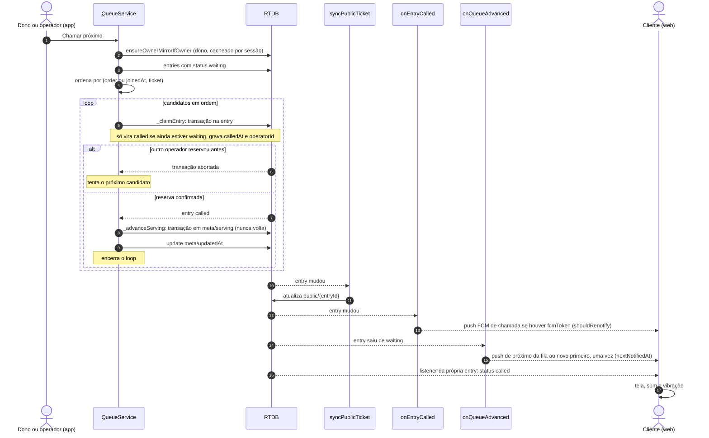
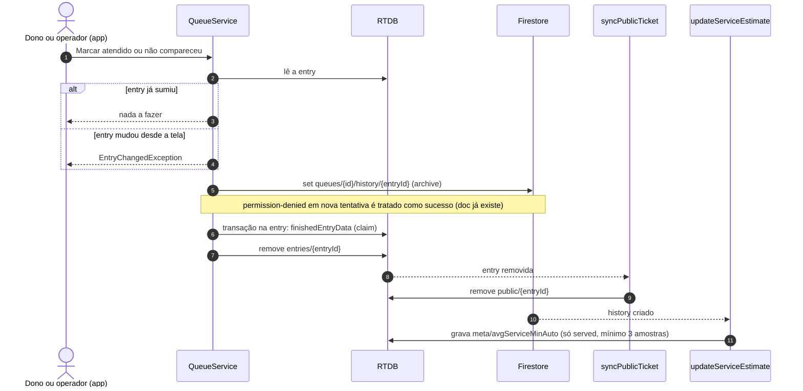
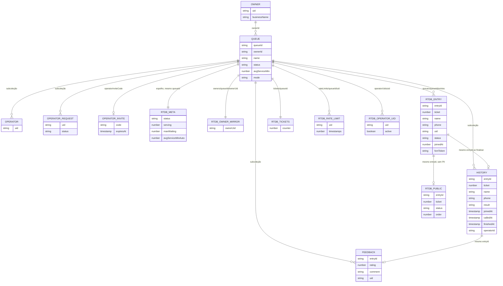

# Diagramas de arquitetura

Diagramas em Mermaid (renderizados pelo GitHub), escritos a partir de `functions/index.js`, `app/lib/services/queue_service.dart`, `database.rules.json`, `firestore.rules` e `docs/RESUMO_TECNICO.md`. Simplificados de propósito: omitem grupos, alertas, horário de funcionamento e analytics. Ver também [`modelo-de-ameacas.md`](./modelo-de-ameacas.md) e [`limitacoes-e-trabalhos-futuros.md`](./limitacoes-e-trabalhos-futuros.md).

## 1. Componentes

Pontos de leitura:

- O cliente web **não escreve** em `entries` nem em `tickets`; só chama a callable `joinQueue`. Depois da entrada, ele altera na própria entry apenas `status: 'left'` e `fcmToken` (rules do RTDB).
- O app faz dual-write: Firestore é a fonte da verdade e o RTDB recebe um espelho (`meta`, `owners/{queueId}`, `operatorUids`).
- O App Check existe só nas callables (hoje sem enforcement); RTDB, Firestore e Storage não o usam porque o app Flutter não passa pelo Play Integrity fora da Play Store.

## 2. Sequência de `joinQueue`

Ordem das checagens conforme `functions/index.js` (callable `joinQueue`, região `us-central1`).

Observações: a checagem de limite e a de slot **não** são transacionais com a criação da entry; joins simultâneos podem ultrapassar a capacidade em uma ou duas vagas.

## 3. Sequência de `callNext`

Do app Flutter (`QueueService.callNext`, `_claimEntry`, `_advanceServing`) até o cliente.

Observação: a reserva é por transação na entry; o `serving` é uma transação separada que só avança. Se o app cair entre as duas, a entry fica `called` com `serving` atrasado até a próxima chamada.

## 4. Fluxo de finalização (atendido ou não compareceu)

`QueueService._finishEntry`: arquivar, reservar por transação e só então remover.

Cliente que sai (`left`) segue outro caminho: o cliente grava `status: 'left'`, e `syncPublicTicket` cria `history/{entryId}` com `result: 'left'` via Admin, remove `entries/{entryId}` e `public/{entryId}`.

Ordem e falhas: se o arquivamento falhar com erro que não seja `permission-denied`, a entry permanece no RTDB e o dono pode tentar de novo. Se cair depois do arquivamento e antes do `remove`, a nova tentativa grava o mesmo `history` (mesmo `entryId`) e conclui.

## 5. Modelo de dados (ER simplificado)

Não são tabelas relacionais: o Firestore tem coleções e subcoleções; o RTDB é uma árvore JSON. As relações abaixo são por identificador. Campos listados são os principais, não todos.

Nomes com prefixo `RTDB_` estão na Realtime Database; os demais estão no Firestore. `operatorInvites/{code}` (Firestore, na raiz) é a fonte da verdade do convite; o campo na fila é só ponteiro.

## 6. Por que dois bancos

Resumo de `docs/RESUMO_TECNICO.md` §4, com ressalvas.

| Aspecto | Firestore | RTDB |
| --- | --- | --- |
| Papel | Configuração, histórico, feedback, operadores, dados do dono (fonte da verdade) | Estado vivo: entries, `public`, `meta`, contador de senha |
| Padrão de acesso | Consultas e leituras pontuais; agregações de métricas sobre o `history` | Listeners contínuos com sincronização automática |
| Transações | Disponíveis, mas o fluxo de chamada usa as do RTDB por nó | Transações por nó (`_claimEntry`, `serving`, `tickets`, `rateLimits`) |
| Regras | Por papel (dono, operador, anônimo) em `firestore.rules` | Por nó, com `.validate` de formato em `database.rules.json` |

Custo da escolha, que o TCC deve declarar: o **dual-write** (app grava no Firestore e espelha no RTDB). Uma falha entre as duas escritas deixa os dois divergentes até o próximo `ensureMirror`. A alternativa de replicar Firestore para RTDB por trigger está em #164 e não foi feita. Os números de latência e de cota citados em `RESUMO_TECNICO.md` §4 e §9 são ordens de grandeza do documento, **não medidos neste projeto**.
