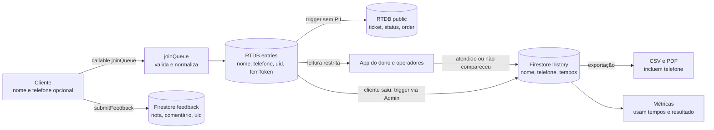

# Modelo de ameaças

Modelo enxuto, sem pretensão de auditoria. Baseado nas rules (`database.rules.json`, `firestore.rules`, `storage.rules`), em `functions/index.js` e em `docs/RESUMO_TECNICO.md` §6. **Não houve teste de intrusão nem revisão externa.** O que está coberto por teste automatizado são as rules e a callable `joinQueue` (ver [`../qualidade.md`](../qualidade.md)). Diagramas em [`diagramas.md`](./diagramas.md).

## 1. Ativos

| Ativo | Onde está | Sensibilidade |
| --- | --- | --- |
| Nome e telefone do cliente | RTDB `entries` (enquanto ativo); Firestore `history` (depois); CSV/PDF exportados | Dado pessoal (LGPD) |
| Integridade da ordem e do estado da fila | RTDB `entries`, `meta/serving`, `tickets` | Alta: afeta o atendimento |
| Conta e dados do dono/operador | Auth, `owners/{uid}`, tokens em `owners/{uid}/devices` | Média |
| Histórico, métricas e avaliações | Firestore `history`, `feedback` | Média; contém PII no `history` |
| `fcmToken` do cliente | RTDB `entries/{id}` | Média: permite enviar push ao aparelho |
| Disponibilidade e custo | Functions, RTDB, FCM (plano Blaze) | Média: abuso gera custo |

## 2. Atores

| Ator | Capacidade esperada |
| --- | --- |
| Cliente legítimo | Auth anônima; entra pela callable; lê a própria entry e `public/`; sai da fila |
| Dono | Conta email/Google; controla fila, operadores, histórico e exportações |
| Operador | Conta não anônima; chama e finaliza entradas das filas em que foi aprovado |
| Visitante malicioso | Tem o link/QR; pode abrir várias sessões anônimas; pode usar scripts |
| Operador mal-intencionado ou removido | Acesso legítimo até a remoção; pode ver nome e telefone |
| Atacante externo ao sistema | Sem credenciais; tenta chamar APIs do Firebase diretamente |

## 3. Fronteiras de confiança

1. **Navegador do cliente e app do dono → Firebase:** nada vindo do cliente é confiável; só as rules e as functions decidem.
2. **Cliente → Admin SDK (callables):** a callable roda com privilégio total e precisa validar tudo (nome, telefone, fila, status, limites).
3. **Firestore ↔ RTDB:** o app mantém os dois; o RTDB depende do espelho `owners/{queueId}/ownerUid` para autorizar o dono.
4. **Sistema → provedores (FCM, Hosting):** confiança no provedor; o `fcmToken` sai do navegador e fica no RTDB.
5. **Exportação (CSV/PDF) → fora do sistema:** o arquivo sai do controle das rules.

## 4. STRIDE por componente

S = spoofing, T = tampering, R = repudiation, I = information disclosure, D = denial of service, E = elevation of privilege.

| Componente | Ameaça | Controle existente | Risco residual |
| --- | --- | --- | --- |
| **Web / auth anônima** | S: fingir ser outro cliente | `uid` imutável na entry; cliente só lê a própria entry | Sem verificação de identidade real; uid é por navegador |
| | D/abuso: entradas em massa ou falsas | Rate limit de 3 joins por 10 min por `uid` (por fila); telefone ativo único; `maxWaiting`; App Check opcional | Várias sessões anônimas contornam o limite por `uid`; App Check sem enforcement; presença física não é provada |
| **Callable `joinQueue`** | T: dados inválidos | Validação de nome (1 a 60) e telefone, `queueId` sanitizado, status `open` | Contagem de `maxWaiting` e de slot sem transação (passa 1 a 2 vagas) |
| | E: criar entry fora do fluxo | Cliente não escreve em `entries` nem em `tickets` (rules); callable usa Admin SDK | Bug na callable teria privilégio total |
| | D: abuso de custo | Rate limit; `guarded` registra erros e converte para `HttpsError` | Sem limite global por IP; sem orçamento/alerta confirmado (#163) |
| **RTDB `entries`** | I: leitura de PII por terceiros | Leitura só de dono, operador (`operatorUids`) e autor da entry | Operador vê telefone completo (decisão LGPD em #172) |
| | T: cliente altera ticket, nome, ordem | Rules deixam o cliente mudar só `status: 'left'` e `fcmToken`; campos extras rejeitados (`$other`) | O cliente pode escrever `fcmToken` arbitrário na própria entry |
| **RTDB `public/`** | I: vazamento de PII | Contém só `ticket`, `status`, `order` (e `slotId`); sem nome nem telefone; sem escrita por cliente | Qualquer autenticado (inclusive anônimo) lê todas as posições; permite estimar a fila de qualquer `queueId` conhecido |
| **RTDB `meta`, `serving`** | T: terceiro altera o estado da fila | `meta` só pelo dono; `serving`/`updatedAt` também por operador; `serving` só avança (transação) | Dependência do espelho `owners/{queueId}`; `calledAt` = relógio local + `serverTimeOffset` (erro < 1 RTT, #189); rules exigem número e `status` na entry |
| **Firestore (dono)** | E: acessar fila alheia | `ownerId == auth.uid` em `queues`, `history`, `feedback`, `operators` | Limite de 20 filas por dono só no app; dono pode ultrapassar com cliente modificado |
| | S: operador falso | Convite com código de 6 caracteres e validade; leitura do convite e pedido de operador exigem conta não anônima; dono aprova | Código por 24 h pode ser repassado; sem 2º fator |
| | R: negar quem chamou | `history` guarda `calledBy` e `operatorId` | Sem log de auditoria completo (mover, remover) (#96) |
| **Functions de push** | I/S: push indevido | Tokens por dono em `owners/{uid}/devices` (rules do próprio uid); tokens inválidos apagados | Entrega em aparelho real não validada |
| **Storage (logos)** | T: upload malicioso | Escrita só do dono, < 300 KB, tipos de imagem, nome fixo; web aceita só URL do Firebase Storage | Leitura pública por design |
| **Exportação** | I: vazamento do arquivo | Só o dono exporta | CSV/PDF incluem telefone por padrão (#160) |

## 5. Controles existentes (resumo)

- Rules por papel (dono, operador, autor da entry, autenticado) no RTDB e no Firestore, com testes automatizados em `rules-tests/`.
- Rate limit de 3 joins por 10 minutos por `uid` e por fila, configurável por variáveis de ambiente.
- Validações de tamanho e formato (nome, telefone, descrição, cor, slots, URL do logo).
- App Check (reCAPTCHA Enterprise) nas callables `joinQueue` e `submitFeedback`, **sem enforcement ainda** (`docs/APPCHECK.md`).
- Convites e pedidos de operador só para contas não anônimas; aprovação pelo dono; remoção revoga o acesso na hora.
- `public/` sem PII; a posição do cliente é calculada a partir dele.
- `submitFeedback` idempotente e restrito a atendimentos `served`.
- Logging estruturado nas functions (`docs/monitoring.md`).

## 6. Riscos residuais

| Risco | Descrição | Mitigação possível |
| --- | --- | --- |
| Auth anônima | Não prova presença física nem identidade; várias sessões por pessoa | Enforcement de App Check, QR com token rotativo, geolocalização (trabalho futuro) |
| Contagem sem transação | `queue-full` e `slot-full` podem passar 1 a 2 vagas em joins simultâneos | Contador transacional no `meta` (#158 é parcialmente relacionado) |
| Limite de filas só no cliente | 20 filas por dono é checado no app; as rules não impõem | Contador ou checagem em function/rule |
| Relógio do cliente | `calledAt` é gravado com `DateTime.now()` do aparelho do operador em `_claimEntry`; `order`, `recalledAt` e `finishedAt` usam timestamp do servidor. Relógio errado distorce tempo de atendimento e espera nas métricas | Usar `ServerValue.timestamp` também em `calledAt` |
| Dual-write | Firestore e RTDB podem divergir se a segunda escrita falhar | Replicação por trigger (#164); `ensureMirror` reconcilia antes de escritas |
| Operador com acesso à PII | Vê nome e telefone enquanto operador | Telefone mascarado ou sob demanda (#153, #172) |
| Retenção indefinida | `history` e `feedback` não expiram | TTL e anonimização (#160) |
| Token FCM arbitrário | Cliente grava qualquer `fcmToken` na própria entry | Validar formato/tamanho nas rules |

## 7. Fluxo de dados pessoais

Pontos a declarar no texto do TCC:

- **Dados coletados do cliente:** nome (obrigatório), telefone (opcional), `uid` anônimo, idioma, `fcmToken` (se ativar o aviso), nota e comentário (opcionais).
- **Quando saem do RTDB:** a entry é removida ao ser finalizada ou quando o cliente sai; o `public/` não contém PII. Deletar a fila apaga entries, `public`, `meta`, `tickets` e depois `history` e a fila no Firestore.
- **Retenção atual:** o `history` e o `feedback` **não têm prazo de expiração**; permanecem até o dono apagar a fila. Não há política de privacidade publicada, nem fluxo de direitos do titular, nem opção de anonimizar o telefone ao arquivar. Estão previstos em #159, #160 e #162.
- **Papéis (controlador/operador, art. 5º LGPD):** quem é o controlador (o estabelecimento ou o autor do sistema) **ainda não foi definido** (decisão em #172). A redação jurídica deve ser revisada pelo orientador.
- **Analytics:** eventos sem PII, com opt-out no app (`docs/monitoring.md`).
